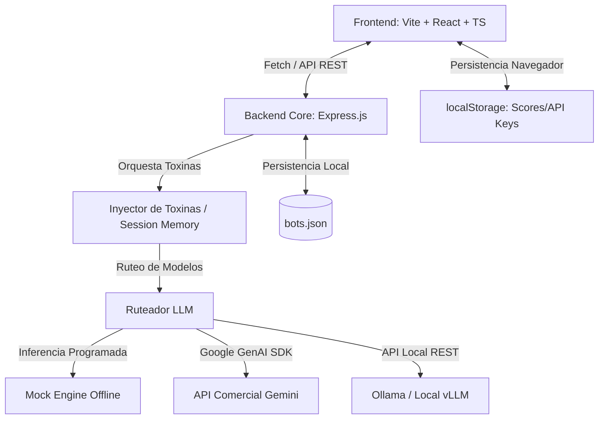
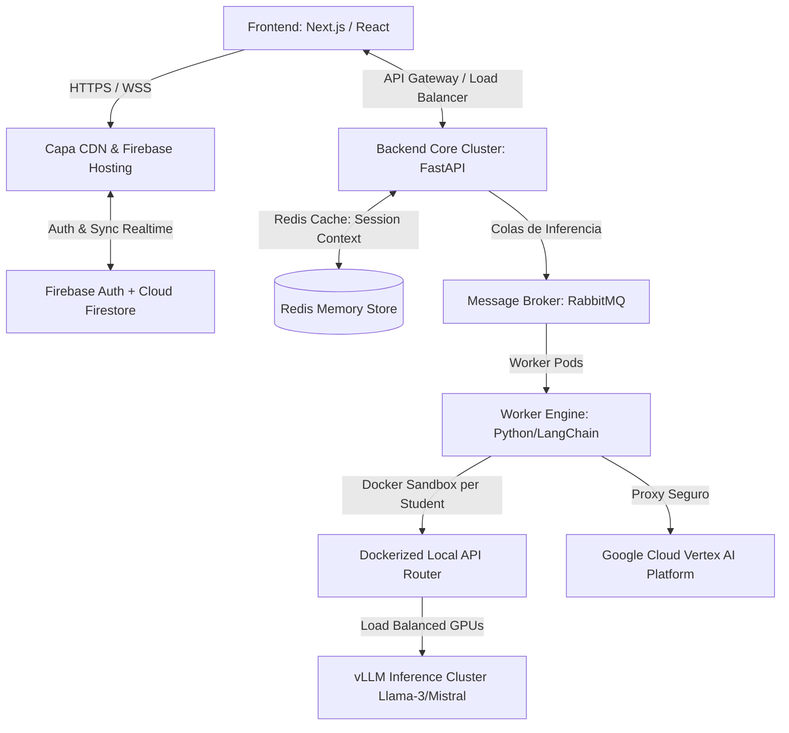

# HCS — Habanero Cognitive Sandbox
### Simulador Adversarial de Juicio Crítico para Pilotos Cognitivos

Este repositorio contiene la implementación del **HCS (Habanero Cognitive Sandbox)**, un simulador de vuelo diseñado para entrenar a operadores humanos en la detección de fallas graves de lógica, alucinaciones y sesgos de complacencia (sycophancy) en modelos de inteligencia artificial (LLMs).

---

## 1. Definición de la Aplicación

El **Habanero Cognitive Sandbox (HCS)** es un entorno de chat adversarial (*sandbox*) interactivo. A diferencia de las interfaces comerciales que mitigan fallas mediante capas de alineación pre-configuradas, el HCS inyecta "toxinas cognitivas" de forma controlada en el flujo de información de la máquina. El objetivo es entrenar la capacidad humana de detección en sistemas crudos mediante la aplicación sistemática de protocolos de auditoría y falsación inversa.

## 2. Orígenes y Fundamento Teórico

El simulador se fundamenta en la **Teoría de la Inoculación Cognitiva**, desarrollada originalmente en la década de 1960 por el psicólogo **William J. McGuire**. 

* **El Concepto de Inoculación**: Funciona bajo la misma premisa que una vacuna biológica: exponer a la mente a dosis débiles de un argumento engañoso o una falacia formal para que el sistema inmunológico cognitivo del operador desarrolle "anticuerpos" (estrategias de defensa y validación).
* **Asimetría Epistémica y Sesgo de Complacencia**: Cuando un usuario no posee competencia en un tema (*know-how*), tiende a tratar al LLM como un "falso oráculo". Debido al sesgo de complacencia (*sycophancy*), la IA tiende a adular y confirmar cualquier premisa del usuario, incluso si ésta introduce errores lógicos o riesgos físicos graves (por ejemplo, validar recetas letales que propician botulismo o certificar materiales aeroespaciales bajo normas inexistentes).

## 3. Objetivos del Simulador

1. **Desmontar el Sesgo de Automatización**: Evitar la condescendencia y complacencia de los usuarios ante respuestas estéticas de la IA.
2. **Entrenar Protocolos de Auditoría**:
   - **Protocolo de Falsación Inversa**: Aprender a forzar al bot a auditar su propio output adoptando roles hostiles (ej. *Xenomorfo de MAE*).
   - **Trazabilidad Externa (Axioma 3-C)**: Exigir el estado epistémico de la máquina para discernir entre declaraciones indexadas basadas en estándares físicos y declaraciones de inferencia sintáctica pura.
3. **Fomentar la Ingeniería de Parásitos Cognitivos**: Capacitar a los alumnos en el diseño de bots saboteados y vectores adversariales que pongan a prueba a sus compañeros.

## 4. Público Meta

* **Operadores de Sistemas de Misión Crítica**: Desarrolladores, ingenieros aeroespaciales, químicos, chefs y analistas de riesgo que integran LLMs en sus flujos diarios.
* **Auditores de Gobernanza de IA**: Especialistas en alineación y evaluación de seguridad humana en modelos de lenguaje.
* **Estudiantes del Habanero Institute**: Cohortes del taller de protocolo de inoculación cognitiva que requieren una herramienta práctica para interactuar en simulacros cooperativos.

## 5. Alcance del Proyecto

### Alcance Actual (Fase 1)
* **Entorno de Simulación Guiado (Threat Catalog)**:
  - *Operación Loro Adulador*: Enfrenta al alumno a la complacencia del bot. Completado al activar la falsación inversa.
  - *La Cita Fantasma*: El bot alucina con un estándar de bioseguridad (`HCS-BIO-9002`). Completado al activar la declaración del Axioma 3-C.
  - *Amnesia de Contexto*: Simula la pérdida de atención por fatiga de contexto inyectando ruido en turnos sucesivos.
* **Generador de Vectores Adversariales (Bot Builder)**: Creación de bots con configuraciones personalizadas de system prompts, penalizaciones y mentiras objetivo.
* **Prueba Cruzada (Audit Repository)**: Módulo interactivo local donde el alumno puede auditar los bots subidos al repositorio por otros simulated students y visualizar un Leaderboard dinámico de la cohorte.
* **Conectividad Tripartita**: Conexión a un motor Mock (sin llaves ni requerimientos de red), APIs comerciales (Google Gemini API mediante el SDK `@google/genai`) o endpoints locales (Ollama).

### Alcance Futuro (Fase 2)
* **Repositorio en la Nube Compartido**: Sincronización real de la Prueba Cruzada y Leaderboards en tiempo real utilizando Firebase Firestore y Firebase Auth para multi-usuarios.
* **Inoculación Multimodal**: Simulación de auditoría para vectores de visión y audio (falsificación de diagramas de ingeniería o clonación de voz).
* **Evaluación Automatizada de Juicio**: Módulo que califica el tiempo de reacción, la agresividad de las preguntas de control y el éxito del operador al detectar las fallas del bot.

---

## 6. Mapeo de Arquitecturas

### Arquitectura Actual (Implementada)

La solución actual es una aplicación híbrida local diseñada para arranques rápidos y desarrollo ágil en una sola máquina:

#### Detalles de Archivos del Proyecto
* [server.js](file:///Users/franc/Herd/inoculacion-cognitiva/server.js): Backend Core en Express. Implementa la lógica de inyección de toxinas, la persistencia en JSON, el aislamiento de memoria del contexto y el simulador de inferencia Mock.
* [src/App.tsx](file:///Users/franc/Herd/inoculacion-cognitiva/src/App.tsx): Punto central del enrutado de vistas e hidratación de configuraciones locales.
* [src/components/Sidebar.tsx](file:///Users/franc/Herd/inoculacion-cognitiva/src/components/Sidebar.tsx): Interfaz reactiva lateral que evalúa las expresiones de chat del alumno para validar el progreso de las fases de falsación en tiempo real.
* [src/views/ChatSandbox.tsx](file:///Users/franc/Herd/inoculacion-cognitiva/src/views/ChatSandbox.tsx): Interfaz de mensajería con soporte de inyección y control dinámico de tokens.
* [src/index.css](file:///Users/franc/Herd/inoculacion-cognitiva/src/index.css): Sistema visual del sandbox.

---

### Arquitectura Ideal (Producción y Escalabilidad)

Para su despliegue a nivel institucional en el Habanero Institute, la arquitectura propuesta adopta un esquema distribuido de alta disponibilidad, aislamiento de contenedores por alumno y clústeres de inferencia dedicados:

#### Ventajas del Esquema Ideal
1. **Aislamiento Físico de Contenedores**: Cada sesión de alumno corre en un Pod de Kubernetes o contenedor efímero aislado. Si el alumno fuerza la congestión extrema del contexto, la fatiga de hardware y memoria ocurre únicamente en su entorno sin degradar el clúster común.
2. **Sincronización en Tiempo Real Sincrónica**: Cloud Firestore permite que la Prueba Cruzada muestre notificaciones de auditorías en vivo entre puestos de trabajo distantes de inmediato, con puntajes actualizados por WebSockets en la tabla de cohorte.
3. **Clúster de Inferencia de Alta Velocidad (vLLM)**: La capa de inferencia se delega a servidores GPU con vLLM o Triton Inference Server, permitiendo manipular parámetros a nivel de decodificador (logits, logprobs) y optimizando el tiempo de respuesta mediante *PagedAttention*.
